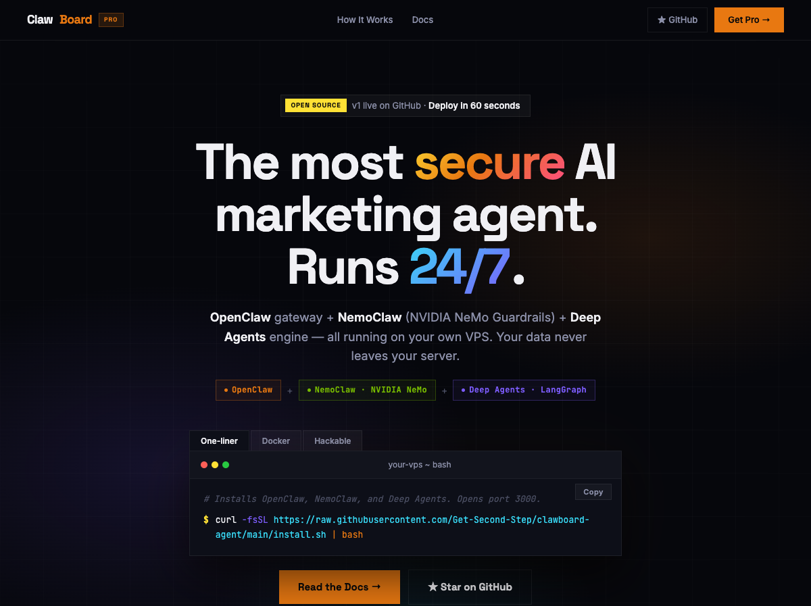

# ClawBoard — AI Marketing Audit Agent



> **The most secure AI marketing agent. Runs 24/7 on your own VPS.**
> Open source · MIT License · [clawboard.pro](https://clawboard.pro)

---

## What is ClawBoard?

ClawBoard is an AI agent that audits your Google Ads, Meta Ads, and GA4 accounts — automatically, every day — and sends you a report on Telegram, Slack, or WhatsApp.

Think of it like hiring a marketing analyst who works 24/7, never misses anything, costs almost nothing to run, and keeps all your client data on your own server.

**In plain English:**
- You connect your ad accounts once
- ClawBoard runs 122 checks across Google Ads, Meta, and GA4
- It finds problems: wasted budget, broken tracking, bad settings, poor performance
- It sends you a branded PDF report with a priority action list
- It keeps watching and alerts you the moment something breaks

No dashboards. No manual exports. Just a report in your inbox every morning.

---

## Deploy in 60 seconds

```bash
curl -fsSL https://raw.githubusercontent.com/Get-Second-Step/clawboard-agent/main/install.sh | bash
```

Or with Docker:

```bash
git clone https://github.com/Get-Second-Step/clawboard-agent.git && cd clawboard-agent
cp config/credentials.env.example config/credentials.env
docker compose up -d
```

Ubuntu 20.04+ · Python 3.11 · 1GB RAM minimum

---

## How it works — 3 engines under the hood

ClawBoard is built from three pieces that work together:

### 🌐 OpenClaw — The Gateway
This is the browser UI and WebSocket server. You open it in your browser, connect your ad accounts, and chat with your data. You can also control everything from Telegram without touching the UI.

### 🛡️ NemoClaw — The Security Layer
Built on NVIDIA NeMo Guardrails. Every instruction going *into* the AI and every answer coming *out* passes through NemoClaw first. It blocks prompt injection attacks (yes, malicious campaign names are a real thing), catches hallucinated numbers, and makes sure your API keys never leak. No other AI marketing tool does this.

### ⚡ Deep Agents — The Audit Engine
Instead of sending one massive prompt to a single AI model, Deep Agents runs 4–6 specialist sub-agents *at the same time*, each focused on one area. This makes audits 4x faster and 67% cheaper on API costs. With Gemini 2.5 Flash as the default model (free tier: 1M tokens/day), daily audits cost **$0**.

---

## The Agent Roster

The agents are named after Hindu mythology — a deliberate choice by the Indian founder who built this.

| Agent | Role | Checks |
|---|---|---|
| 🐘 **Ganesha** | Orchestrator — breaks the audit into tasks and delegates | — |
| 🔱 **Shiva** | Google Ads — destroys wasted spend | 74 checks |
| 🌸 **Brahma** | Meta Ads — builds audiences and creative quality | 46 checks |
| 🌊 **Vishnu** | GA4 Analytics — preserves data integrity | 30 checks |
| 🏹 **Arjuna** | Budget & Bidding — precision on every dollar | 10 checks |
| 💰 **Lakshmi** | Report Generator — turns findings into a beautiful PDF | — |

**Total: 122 audit checks, running in parallel, in 2–3 minutes.**

---

## Setup after install

```bash
# 1. Add your API keys
nano ~/clawboard-agent/config/credentials.env

# 2. Generate Google OAuth token
cd ~/clawboard-agent && python3 scripts/generate_google_token.py

# 3. Run your first audit
cd ~/clawboard-agent && uv run python audit_agent.py "Audit my Google Ads account"
```

### Credentials you need

| Credential | Where to get it |
|---|---|
| `GOOGLE_AI_API_KEY` | [aistudio.google.com](https://aistudio.google.com) |
| `GOOGLE_ADS_DEVELOPER_TOKEN` | Google Ads → Tools → API Center |
| `GOOGLE_CLIENT_ID/SECRET` | Google Cloud Console → OAuth 2.0 |
| `GOOGLE_REFRESH_TOKEN` | Run `python3 scripts/generate_google_token.py` |
| `TELEGRAM_BOT_TOKEN` | [@BotFather](https://t.me/BotFather) on Telegram |

---

## Why self-hosted?

Every other AI marketing tool is a SaaS. That means your client's OAuth tokens, account IDs, and campaign data travel through someone else's servers.

ClawBoard runs entirely on your VPS. Your credentials are stored only in your `credentials.env` file. Nothing leaves your server. For agencies managing multiple client accounts, this is the only architecture that's actually defensible.

---

## What's live vs coming soon

| Agent | Status |
|---|---|
| 🔍 Audit Agent — 122 checks, PDF report, Telegram delivery | ✅ Live |
| 👂 Listen Agent — real-time alerts when budgets exhaust or CPA spikes | 🔜 Coming soon |
| ⚡ Paid Media Agent — executes approved optimisations via Google Ads API | 🔜 Coming soon |
| 📊 CEO Agent — plain English weekly brief, delivered Sunday evening | 🔜 Coming soon |

---

## Run manually

```bash
cd ~/clawboard-agent
uv run python audit_agent.py "Run a full audit for 'Client Name'"
uv run python audit_agent.py "Google Ads audit only for 'Client Name'"
```

Reports are saved to `reports/` as HTML and PDF.

---

## Stats

| | |
|---|---|
| Audit checks | 122 |
| Security layers | 3 (NemoClaw) |
| API cost reduction | 67% vs single-agent |
| Default LLM | Gemini 2.5 Flash (free tier) |
| Monthly cost for daily audits | $0 |

---

Built by [Second Step Agency](https://getsecondstep.com) · MIT License · [clawboard.pro](https://clawboard.pro)
